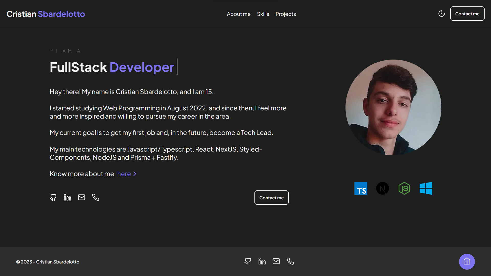
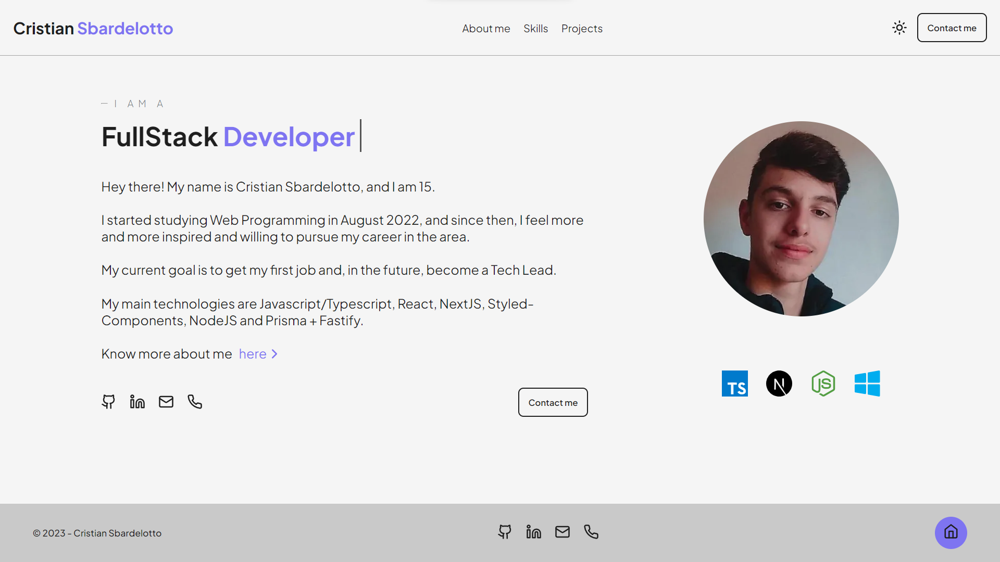
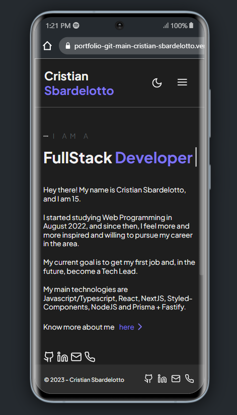

<h1 align="center"> My Portfolio </h1>

<p align="center">
Welcome to my portfolio! This is a website that show my abilities and best projects in Web Development.
This project also makes it easy to contact with me.
</p>

<p align="center">
  <a href="#technologies">Technologies</a>&nbsp;&nbsp;&nbsp;|&nbsp;&nbsp;&nbsp;
  <a href="#learning">What I've Learned</a>&nbsp;&nbsp;&nbsp;|&nbsp;&nbsp;&nbsp;
  <a href="#installation">Installation</a>&nbsp;&nbsp;&nbsp;|&nbsp;&nbsp;&nbsp;
  <a href="#contribution">Contribution</a>&nbsp;&nbsp;&nbsp;|&nbsp;&nbsp;&nbsp;
  <a href="#layout">Layout</a>&nbsp;&nbsp;&nbsp;&nbsp;&nbsp;&nbsp;
</p>

<br>

<p align="center">
  <strong> Dark mode: </strong>
  
</p>

<p align="center">
  <strong>Light mode:</strong>
  
</p>

<p align="center">
  <strong>Mobile:</strong>
</p>

<p align="center">
  
</p>

<br />
<h1 id='technologies'>🖱️ Technologies</h2>

<p>This project was made with the following technologies/libraries:</p>

- TypeScript
- NextJS
- Styled-components
- Swiper ( slides )
- Lucide-react ( icons )
- Git
- Github
- Eslint + Prettier ( code maintenance )

<br />

<h1 id='learning'>🧠 What I've Learned</h2>

<p>In this website, I worked with:</p>

- A new lib for slides ( [Swiper](https://swiperjs.com/) )
- [Mock files](./src/data/)
- [Custom hooks](./src/hooks/useTheme.ts)
- [Import/export types](./src/types/index.ts)

<br />

<h1 id='layout'>🖥️ Layout</h1>

<br />


### To make this project, I used this [Figma Design](link).

### To see the Deploy, check [THIS LINK](https://portfolio-git-main-cristian-sbardelotto.vercel.app/).

<br />

<h1 id='installation'>📤 Installation</h1>

<h3>Firstly, you need to <strong>clone the project</strong> on your machine:</h3>


```bash
git clone https://github.com/cristian-sbardelotto/portfolio
```
<br />

<h3>After that, open the project folder and <strong>install the dependencies:</strong></h3>


```bash
npm install
# or
yarn
#or
pnpm install
```

<h3>To <strong>run the project</strong> on your browser, use:</h3>

```bash
npm run dev
# or
yarn dev
# or
pnpm dev
```

<br/>

<h1 id='contribution'>🤝 Contribution</h1>

<br />

**1.** Fork the `cristian-sbardelotto/portfolio` repository on GitHub.

**2.** Create a new branch for your changes.

**3.** Make the desired changes and commit.

**4.** Submit a pull request with your changes.

<br />

---

<div align='center'>

<h2 align='center'>Enjoy this project!</h2>

<br />

Developed with ❤️ by <strong>Cristian Sbardelotto</strong>

<br />

[](https://www.linkedin.com/in/cristian-k-sbardelotto/)
[](https://github.com/cristian-sbardelotto)

</div>
