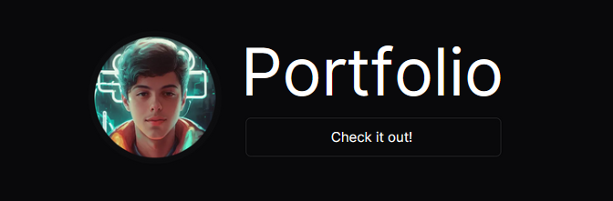

  
# 🧡 Portfolio

[README PT-BR](./README-pt.md)

Welcome to my [portfolio](https://portfolio-chi-lemon-51.vercel.app)! This is a website that show my abilities and best projects in Web Development.
The project also makes it easy to contact with me.

> ⚠️ Feel free to [contact me](https://portfolio-chi-lemon-51.vercel.app/contact), and share your **_feedback_** and **_insights_**, or report a **_bug_**!

  <a href="#technologies">Technologies</a>&nbsp;&nbsp;&nbsp;|&nbsp;&nbsp;&nbsp;
  <a href="#learning">What I've Learned</a>&nbsp;&nbsp;&nbsp;|&nbsp;&nbsp;&nbsp;
  <a href="#deploy">Deploy</a>&nbsp;&nbsp;&nbsp;&nbsp;&nbsp;&nbsp;

## 🛠️ Technologies

This project was made with the following technologies/libraries:

- Typescript
- React
- Next.js
- Styled-components
- Lucide react
- Eslint
- Git & Github

## 🧠 What I've Learned

During the development, I've discovered new things, such as:

- [Mock files](./src/data/)
- [Import/export types](./src/types/index.ts)
- Handle with different animations

## 🌎 Deploy

To check out the deploy, access https://portfolio-chi-lemon-51.vercel.app/

## Enjoy this project!

Developed with 🧡 by **Cristian Sbardelotto**.

